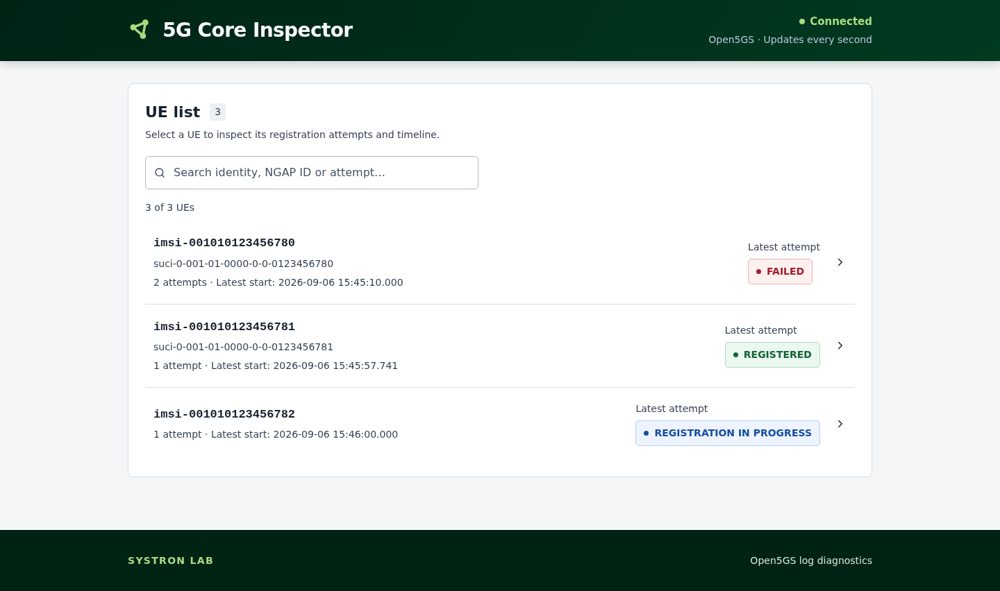
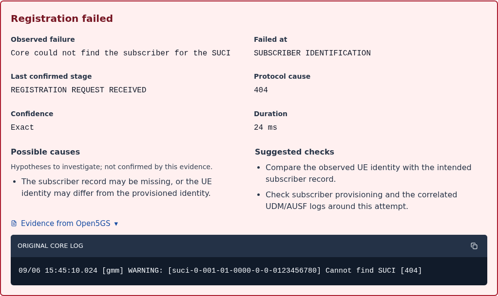

# 5G Core Inspector

**Open5GS & OpenAirInterface log analysis. Understand why a UE registration failed.**

[](https://github.com/mohit4444/5G-Core-Inspector/actions/workflows/checks.yml)
[](#quick-start)

When a UE failed to register on my 5G network, I had to scroll through core logs
to work out what happened. I built this lightweight tool to bring each attempt,
its timeline and the relevant evidence into one screen.

It reads **Open5GS** and **OpenAirInterface (OAI) 5G Core** logs, detects the core
automatically, and opens a troubleshooting dashboard in your browser.


*Dashboard preview using synthetic example data.*

[Quick start](#quick-start) · [Connect your core](#connect-your-core)

## What you can do

- **Find a UE:** search for a phone, modem or simulated device.
- **Follow each attempt:** select a registration and inspect its timeline.
- **Investigate failures:** see the observed failure, possible causes and suggested checks.
- **Read the evidence:** expand original log messages and inspect PDU session details.

<details>
<summary>See a failure diagnosis</summary>


*Synthetic example data.*

</details>

## Quick start

You need Git and [Docker with Compose](https://docs.docker.com/get-started/get-docker/).

```bash
git clone https://github.com/mohit4444/5G-Core-Inspector.git
cd 5G-Core-Inspector
docker compose build
```

Then choose your connection below. No Python or Node.js installation is needed.

<details>
<summary>Try it without a 5G core</summary>

```bash
docker compose up
```

Open http://127.0.0.1:8000 to explore a synthetic Open5GS example.
**Disconnected** is expected when the file finishes; the results stay visible.
Before connecting a live core, press **Ctrl+C** and run `docker compose down`.

</details>

## Connect your core

Your core must already be running, with the UE added to its subscriber list and
matching settings on the UE. Run one of these commands from the Inspector folder
on the same computer. The Inspector runs in Docker in every case.

### Open5GS running in Docker

Find your core's container name with `docker ps`. Replace
`YOUR_AMF_CONTAINER` with the container that provides AMF registration logs:

```bash
docker logs --follow --since 0s YOUR_AMF_CONTAINER 2>&1 \
  | docker compose run --rm --service-ports -T inspector --stdin
```

<details>
<summary>Example using our test system</summary>

`docker-5gc` is the image; `oai_ocudu_5gc` is the container name. AMF runs
inside it alongside the other Open5GS services.

```bash
docker logs --follow --since 0s oai_ocudu_5gc 2>&1 \
  | docker compose run --rm --service-ports -T inspector --stdin
```

</details>

### Open5GS running without Docker

Read new messages from the AMF log file:

```bash
sudo tail -n 0 -F /var/log/open5gs/amf.log \
  | docker compose run --rm --service-ports -T inspector --stdin
```

Change the path if your installation stores logs elsewhere. For data-session
details, add `/var/log/open5gs/smf.log` after the AMF file path.

<details>
<summary>Example using our test system</summary>

We read both AMF and SMF logs:

```bash
sudo tail -n 0 -F /var/log/open5gs/amf.log /var/log/open5gs/smf.log \
  | docker compose run --rm --service-ports -T inspector --stdin
```

</details>

### OAI 5G Core

Enable **debug** logging on the OAI AMF. For a Docker Compose deployment, read
AMF and SMF logs together:

```bash
docker compose -f /path/to/oai/compose.yaml \
  logs --follow --since 0s --no-color oai-amf oai-smf 2>&1 \
  | docker compose run --rm --service-ports -T inspector --stdin
```

Replace the file path and service names with yours. If you started OAI with
`-p`, `--env-file` or extra `-f` files, use those same options on the left side.
Keep the service prefixes in the logs. The same command works for separate
Open5GS AMF/SMF services with their Compose file and service names.

<details>
<summary>Example using our test system</summary>

Our OAI project is named `inspector-oai`. Use your own Compose file path:

```bash
docker compose -p inspector-oai \
  -f /home/mohit/.local/share/inspector/oai-lab/compose.yaml \
  logs --follow --since 0s --no-color oai-amf oai-smf 2>&1 \
  | docker compose run --rm --service-ports -T inspector --stdin
```

</details>

All scenarios use **http://127.0.0.1:8000**. Run one at a time, then connect a UE
and select it to see its timeline.
Start the Inspector before connecting the UE; these commands read new logs only.
Press **Ctrl+C** to stop the Inspector before switching scenarios.

If Docker needs `sudo`, add it before each `docker` command.

### If something looks wrong

- **No UE appears:** reconnect the UE after starting the Inspector. If it still
  does not appear, check that the gNB connects to the core and the UE reaches it.
- **Authentication sync failure:** the core may retry and complete registration.
  This message stays in the timeline; it does not by itself mean registration failed.

## Stop and restart

Press **Ctrl+C** to stop. Run the same connection command to restart or choose
another core. Results stay in memory and are cleared when the Inspector stops.
If live logs disconnect, check the source and restart the Inspector.
